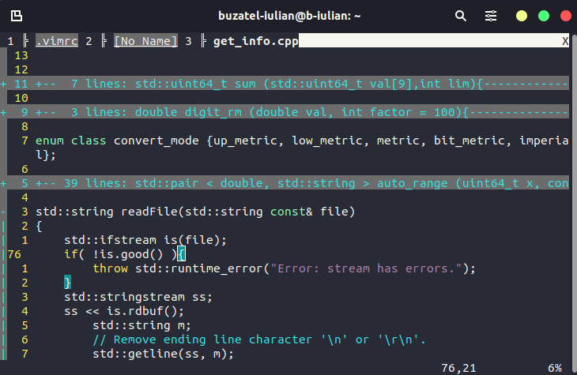

# My personal .vimrc config file

Optimized for navigation and clarity without relying on external plugins.

I mention the fact that some of the most complex script is copied and modified and can be found in any of the following links if anybody wants only specific parts with better explanations :  
* [Showing tab numbers / not showing the whole path of the file](https://vim.fandom.com/wiki/Show_tab_number_in_your_tab_line)
* [Settings for editing markdown files](https://secluded.site/vim-as-a-markdown-editor/)
* [Remembering line folds after exiting a file](https://stackoverflow.com/questions/37552913/vim-how-to-keep-folds-on-save)
